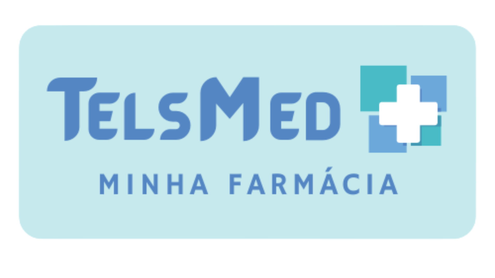

<h3 align="center"> 
  
</h3>

<!-- # Projeto-Final-TelsMe -->
<!-- Projeto Final da Reprograma Back-end -->

#### **Sobre a API**

#### **Rotas**
Esta API está sendo executada na `porta 9095` e para que todas as rotas possam ser acessadas localmente é necessário usar `http://localhost:9095/` antes dos endpoints de requisição.

|VERBO | ENDPOINT | DESCRIÇÃO|
|POST | /create | Cria um usuário para acessar o app TelsMed|
|POST | /login | Cria um login de acesso ao aplicativo|
|GET | /users | Retorna o usuário cadastrado no aplicativo|
|POST | /criarpaciente| Cadastra um novo paciente no Aplicativo|
|GET | /paciente| Retorna uma lista com todos os pacientes cadastrados no app|
|GET | /paciente/:id| Retorna o paciente pelo id informado|
|PATCH | /:id | Atualiza os dados do paciente escolhido|
|DELETE | /:id | Delete o paciente escolhido do aoplicativo| 
|------|--------|------------|
|VERBO | ENDPOINT | DESCRIÇÃO|
|POST | /criarmedicacao | Cadastra uma nova medicação no aplicativo|
|GET | /medicacao/:id | Retorna a medicação pelo id informado|
|GET | /medicacao | Retorna uma lista com todas as medicações cadastradas no app|
|PATCH | /medicacao/:id | Atualiza os dados da medicação escolhida|
|DELETE | /medicacao/:id | Deleta a medicação escolhida do aplicativo|
